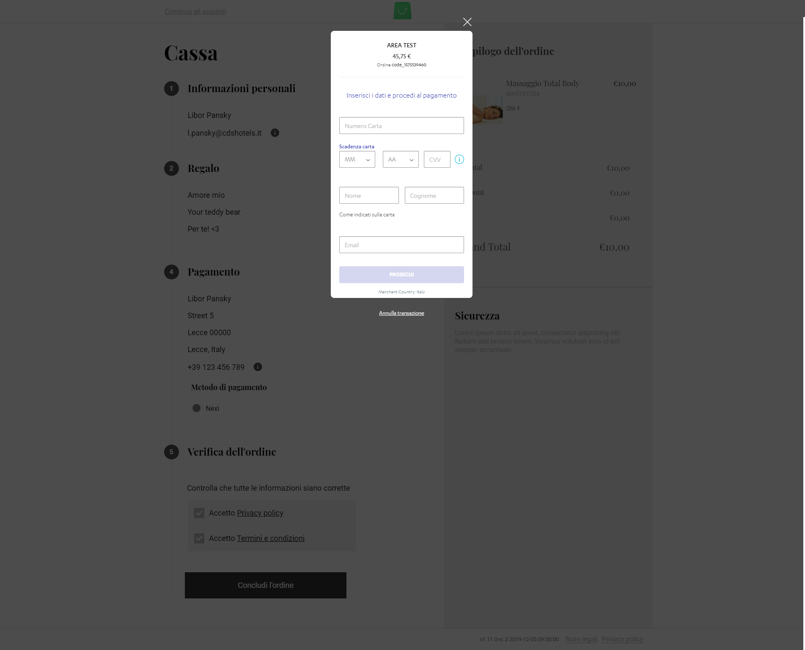

# Nexi Payment module for Vue Storefront

Nexi Payment module for [vue-storefront](https://github.com/DivanteLtd/vue-storefront) by [CDSHotels](https://www.cdshotels.it).



## Installation

By hand (prefered):

```shell
$ git clone git@github.com:cdshotels/vsf-payment-nexi.git ./vue-storefront/src/modules/payment-nexi
```

And add the `nexi` settings to your `config/local.json` and set `nexi.env` to `sandbox` or `production`.

```json
{
  ...,
  "nexi": {
    "env": "sandbox",
    "merchantAlias": "YOUR_MERCHANT_ALIAS",
    "endpoint": {
      "configuration": "http://localhost:8080/api/ext/payment-nexi/configuration"
    }
  }
}
```

## Register the Nexi module

Open in your editor `./src/modules/client.ts`

```ts
...
import { PaymentCashOnDeliveryModule } from './payment-cash-on-delivery'
import { PaymentNexiModule } from './payment-nexi'

export function registerClientModules () {
  ...,
  registerModule(PaymentCashOnDeliveryModule)
  registerModule(PaymentNexiModule)
}
```

## Nexi payment Checkout Review

Under your theme `your-theme/components/core/blocks/Checkout/OrderReview.vue` add the following import to your script

```ts
import NexiDropIn from 'src/modules/payment-nexi/components/DropIn'

export default {
  components: {
    ...
    NexiDropIn
  },
  ...
  computed: {
    payment () {
      return this.$store.state.checkout.paymentDetails
    }
  },
```

And to your template add the nexi drop-in before `button-full`:

```html
<nexi-drop-in v-if="payment.paymentMethod === 'vsfnexi'" />
<button-full
  @click.native="placeOrder"
  data-testid="orderReviewSubmit"
  class="place-order-btn"
  :disabled="$v.orderReview.$invalid"
>
  {{ $t('Place the order') }}
</button-full>
```

## Nexi error messages translation

Because Nexi error handling sux and no user friendly messages are being returned (mix of english and italian phrases abbreviated), we have to prepare custom error messages based on error code.

Add to your localization file(s) following error messages (and fix original translations according to your needs):

```csv
"An error occurred while processing the payment.", "An error occurred while processing the payment."
"Authorization denied by the card issuer.", "Authorization denied by the card issuer."
"Your card is not enrolled for 3D Secure. This means that either the bank that issued the card is not yet supporting 3D Secure or it means that the card holder has not yet been registered for the service.", "Your card is not enrolled for 3D Secure. This means that either the bank that issued the card is not yet supporting 3D Secure or it means that the card holder has not yet been registered for the service."
"Unauthorized card due to BIN Table application rules.", "Unauthorized card due to BIN Table application rules."
"3D Secure canceled by user.", "3D Secure canceled by user."
"Operator not authorized to operate in this mode", "Operator not authorized to operate in this mode"
"Circuit is not accepted, in the request message was indicated to accept payment with a circuit while the card pan is on another circuit.", "Circuit is not accepted, in the request message was indicated to accept payment with a circuit while the card pan is on another circuit."
"Authorization denied", "Authorization denied"
"Card expired", "Card expired"
"Card restricted", "Card restricted"
"Invalid merchant", "Invalid merchant"
"Transaction not permited", "Transaction not permited"
"Your card has insufficient funds", "Your card has insufficient funds"
"An error occurred while saving the payment information", "An error occurred while saving the payment information"
```

## Nexi payment API extension

Setup dependency to api:
`cd ../vue-storefront-api`
`yarn add -W @payment-nexi/checkout-server-sdk`

Install extension to `vue-storefront-api`:

```shell
$ cp -fr src/modules/paypal/api/paypal ../vue-storefront-api/src/api/extensions/
```

Go to api config `./vue-storefront-api/config/local.json` (copy from existing `./vue-storefront-api/config/default.json` config file if it doesn't exist) and register the Nexi API extension:

```json
"registeredExtensions": [
    ...
    "payment-nexi"
]
```

And add the `paymentNexi` settings to `extensions` key:

Add the following also to your `config/local.json` need set:

- `env` to `sandbox` (default) or `production`.
- `defaultCurrency` to one of the following: `[EUR,AUD,CAD,HKD,JPY,CHF,GBP,USD,BRL,SGD,AED,TWD,SAR,IDR,THB,KWD,MYR,QAR,MXN,ZAR,KRW,PLN,INR,PHP,CZK,NZD,CLP,RON,HUF,COP,BHD,EGP,HRK,VEF,JOD,ARS,MOP,DKK,SEK]`.
- `defaultLanguage` to one of the following: `[ITA,JPN,SPA,RUS,FRA,ARA,ENG,GER,CHI,POR]`.

```json
  "extensions": {
    "paymentNexi": {
      "env": "sandbox",
      "apiKey": "__THIS_IS_ACTUALY_NOT_SO_SECRET_BUT_STILL_IN_LOCAL_FILE__",
      "apiSecret": "__THIS_IS_SO_SECRET__",
      "defaultCurrency": "EUR",
      "defaultLanguage": "ITA"
    }
  }
```
